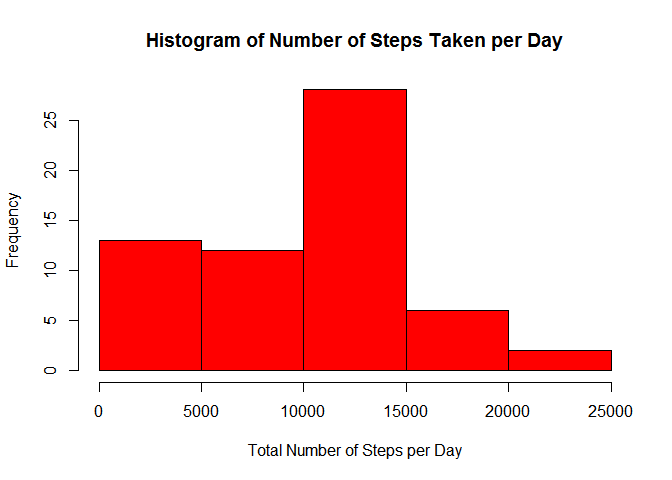
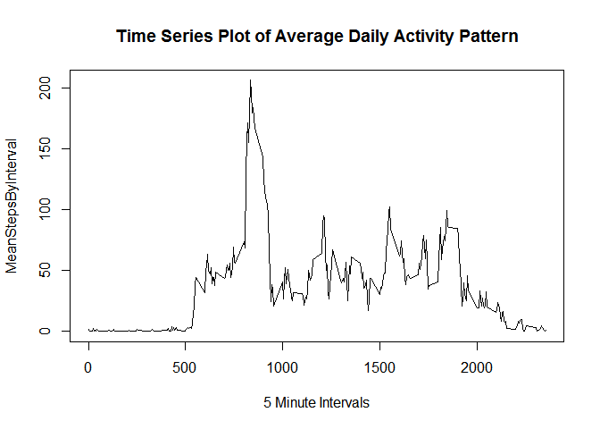
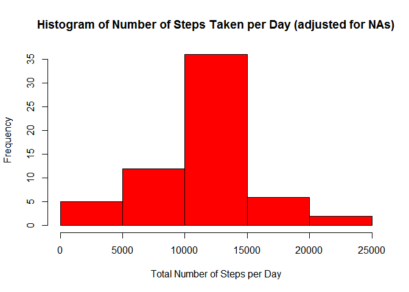
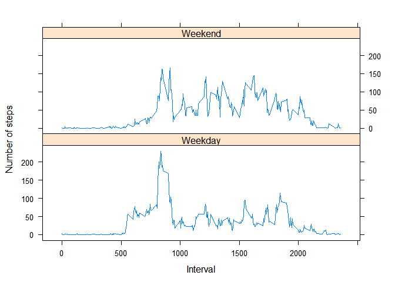

# Reproducible Research: Peer Assessment 1


## Introduction


It is now possible to collect a large amount of data about personal movement using activity monitoring devices such as a Fitbit, Nike Fuelband, or Jawbone Up. These type of devices are part of the "quantified self" movement - a group of enthusiasts who take measurements about themselves regularly to improve their health, to find patterns in their behavior, or because they are tech geeks. But these data remain under-utilized both because the raw data are hard to obtain and there is a lack of statistical methods and software for processing and interpreting the data.

This assignment makes use of data from a personal activity monitoring device. This device collects data at 5 minute intervals through out the day. The data consists of two months of data from an anonymous individual collected during the months of October and November, 2012 and include the number of steps taken in 5 minute intervals each day.

## Loading and preprocessing the data

Before we can load the data into R we must first specify the working directory, then we can loading in the csv file. 

```r
library(lattice)
library(knitr)
setwd("C:/Users/kareem.gamgoum/Desktop/DataScience/Course 5 - Reproducible Research/Course Project 1")
ActivityData <- read.csv ("activity.csv", header = T, sep = ",", stringsAsFactors = F)
ActivityData$date = as.Date(ActivityData$date, "%Y-%m-%d")
```


## What is mean total number of steps taken per day?

To look at the distribution of the number of steps taken per day, we firstly need to group the data by day, and we can do this by summing each entry grouped by day.


```r
TotalStepsByDay <- tapply(ActivityData$steps, ActivityData$date, sum, na.rm=T)
```


Now the data has been aggregated by day we can graph this to see the distribution of the sum of steps per day


```r
hist(TotalStepsByDay, xlab = "Total Number of Steps per Day", main = "Histogram of Number of Steps Taken per Day", col = "red")
```

<!-- -->

We can determine the mean number of steps per day and also the median number of steps per day easily by utilising the grouped sum of steps by day.


```r
MeanStepsByDay <- round(mean(TotalStepsByDay))
MeanStepsByDay
```

```
## [1] 9354
```

The mean number of steps is 9,354


```r
MedianStepsByDay <- round(median(TotalStepsByDay))
MedianStepsByDay
```

```
## [1] 10395
```

The median number of steps is 10,395

## What is the average daily activity pattern?

By taking a different approach and grouping the raw data by intervals, we can study the behaviour of the user throughout the day, averaging the data across all days. The following time series plot shows exactly that.


```r
MeanStepsByInterval <- tapply(ActivityData$steps, ActivityData$interval, mean, na.rm=T)
plot(MeanStepsByInterval ~ unique(ActivityData$interval), type="l", xlab = "5 Minute Intervals", main = "Time Series Plot of Average Daily Activity Pattern")
```

<!-- -->

We can single out the interval which has the highest level of mean steps across all days as shown below. 


```r
round(MeanStepsByInterval[which.max(MeanStepsByInterval)])
```

```
## 835 
## 206
```

So this tells us that interval 835 has the greatest average number of steps across all days, and the maximum value is 206

## Imputing missing values

By running the "summary"" command we can identify which fields contain NA entries. 


```r
summary(ActivityData)
```

```
##      steps             date               interval     
##  Min.   :  0.00   Min.   :2012-10-01   Min.   :   0.0  
##  1st Qu.:  0.00   1st Qu.:2012-10-16   1st Qu.: 588.8  
##  Median :  0.00   Median :2012-10-31   Median :1177.5  
##  Mean   : 37.38   Mean   :2012-10-31   Mean   :1177.5  
##  3rd Qu.: 12.00   3rd Qu.:2012-11-15   3rd Qu.:1766.2  
##  Max.   :806.00   Max.   :2012-11-30   Max.   :2355.0  
##  NA's   :2304
```

So we can see here that there are 2,304 NA entries in the "steps" field, and there are no other NAs in the other fields.

This means that there are a number of days/intervals that are missing an entry for the number of steps taken, and this could introduce bias in some of our calculations and summaries. 


```r
CountOfNAs <- sum(is.na(ActivityData$steps))
CountOfNAs
```

```
## [1] 2304
```

The below tells us that the total number of records in this data is 17,568


```r
CountOfRecords <- nrow(ActivityData)
CountOfRecords
```

```
## [1] 17568
```

and so the percentage of records which are NAs is 13%


```r
CountOfNAs / nrow(ActivityData)
```

```
## [1] 0.1311475
```

As a strategy to overcome the NA's in the dataset, the mean number of steps for the interval will populate the observations where the value is NA. 


```r
ActivityData2 <- ActivityData  
for (i in 1:nrow(ActivityData)){
    if(is.na(ActivityData$steps[i])){
        ActivityData2$steps[i]<- MeanStepsByInterval[[as.character(ActivityData[i, "interval"])]]
    }
}
```

What the above is doing is it is taking an action where an NA has been identified in a row, and it is overwriting the value of steps with the interval average across all days. 

To test this adjustment, we can display as a histogram to see how it compares to our previous histogram.


```r
TotalStepsByDay2 <- tapply(ActivityData2$steps, ActivityData2$date, sum, na.rm=T)
hist(TotalStepsByDay2, xlab = "Total Number of Steps per Day", main = "Histogram of Number of Steps Taken per Day (adjusted for NAs)", col = "red")
```

<!-- -->

It is immediately obvious by comparing this histogram to the previous that the frequencies are reaching a higher value on the y-axis, which would be as a result of more recods being populated with a valid result. We can re-run the mean and median calculation to see how these compare with before. 


```r
MeanStepsByDay2 <- round(mean(TotalStepsByDay2))
MeanStepsByDay2
```

```
## [1] 10766
```

The mean number of steps is 10,766


```r
MedianStepsByDay2 <- round(median(TotalStepsByDay2))
MedianStepsByDay2
```

```
## [1] 10766
```

The median number of steps is also 10,766.

Comparing these values to what we saw earlier, both the mean and the median have increased. Also, as you'd expect, by imputing missing data the estimates of the total daily number of steps has increased as there are more data points to contribute to the count of steps. 

## Are there differences in activity patterns between weekdays and weekends?

To determine whether the dates in the data are weekdays or weekends we must create a factor variable to determine the day of the week.


```r
ActivityData2$day <- as.factor(weekdays(ActivityData2$date))
```

Now we need to create a logical variable which splits the data into weekdays and weekends.


```r
ActivityData2$Weekday <- ifelse(!(ActivityData2$day %in% c("Saturday","Sunday")), TRUE, FALSE) 
```

And we can see the breakdown of records by whether it is a weekday or not by running the following. 


```r
table(ActivityData2$Weekday)
```

```
## 
## FALSE  TRUE 
##  4608 12960
```

To create a time series plot split by Weekdays and weekends, we first need to subset the data into weekdays and weekends, and also calculate the average number of steps taken per 5 minute interval across all days with our new data set ActivityData2


```r
ActivityData2_Weekday <- subset(ActivityData2, ActivityData2$Weekday == TRUE)
ActivityData2_Weekend <- subset(ActivityData2, ActivityData2$Weekday == FALSE)

MeanStepsByInterval2_Weekday <- tapply(ActivityData2_Weekday$steps, ActivityData2_Weekday$interval, mean)
MeanStepsByInterval2_Weekend <- tapply(ActivityData2_Weekend$steps, ActivityData2_Weekend$interval, mean)
```

And now we can bind these two subsets together to form the dataframe needed to plot the time series graph. 


```r
Dataframe_Weekday <- data.frame(Interval = unique(ActivityData2_Weekday$interval), AverageSteps = as.numeric(MeanStepsByInterval2_Weekday), Day = rep("Weekday", length(MeanStepsByInterval2_Weekday)))
Dataframe_Weekend <- data.frame(Interval = unique(ActivityData2_Weekend$interval), AverageSteps = as.numeric(MeanStepsByInterval2_Weekend), Day = rep("Weekend", length(MeanStepsByInterval2_Weekend)))
FinalDataframe <- rbind(Dataframe_Weekday, Dataframe_Weekend)

xyplot(AverageSteps ~ Interval | Day, data = FinalDataframe, layout = c(1, 2), 
       type = "l", ylab = "Number of steps")
```

<!-- -->

By looking at this time series plot we observe that weekdays tends to get more steps in earlier in the day, and a higher number of steps is achieved within these intervals, however weekends tends to have their steps more evenly spread throughout the day. 
 
